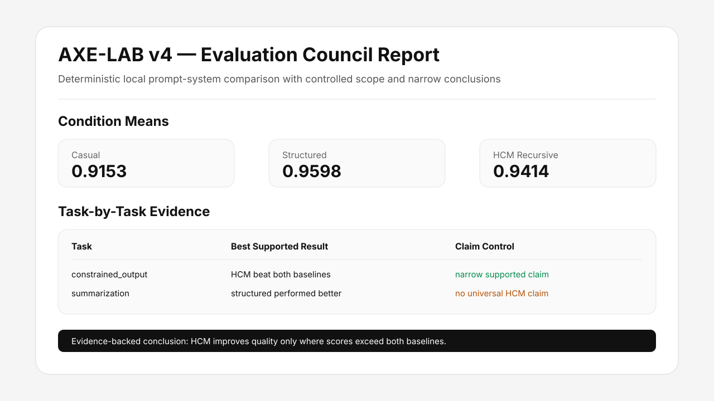
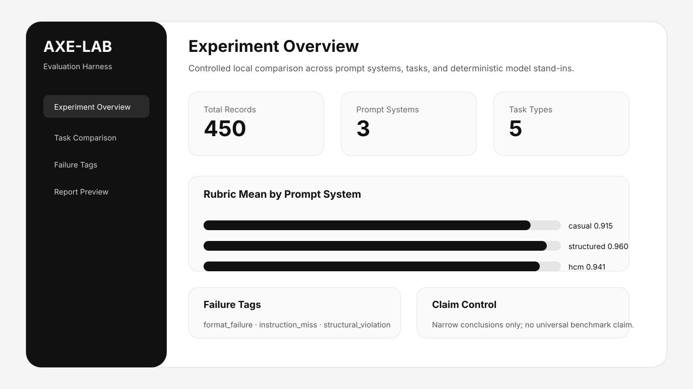

# RESUME-REPO — AI Workflow Proof Hub

This repository is a professional proof-of-work hub. Its featured project is **AXE-LAB v4**, a deterministic LLM evaluation harness for AI workflow, prompt evaluation, AI operations, QA, product operations, and automation roles.

AXE-LAB compares casual, structured, and HCM recursive prompting patterns across controlled task types using deterministic model stand-ins, rubric scoring, failure taxonomy tagging, cost simulation, generated reports, and a Streamlit-ready dashboard scaffold.

## Featured project: AXE-LAB v4

Built AXE-LAB, a deterministic LLM evaluation harness that compares casual, structured, and recursive prompt strategies across task types using rubric scoring, failure taxonomy tagging, reproducible experiment runs, cost modeling, and generated reports to support evidence-based AI workflow evaluation.

## Visual previews

These preview assets are repo-native visual summaries for fast review. They are not live production screenshots; they illustrate the generated report and dashboard concepts documented in the project.





## Fast review links

- Project brief: `docs/PROJECT_BRIEF.md`
- Case study: `docs/CASE_STUDY.md`
- Proof index: `docs/PROOF_INDEX.md`
- ATS alignment: `docs/ATS_ALIGNMENT.md`
- Skill to role map: `docs/SKILL_TO_ROLE_MAP.md`
- Recruiter guide: `docs/RECRUITER_GUIDE.md`
- Architecture: `docs/ARCHITECTURE.md`
- Evaluation method: `docs/EVALUATION_METHOD.md`
- Bias audit: `docs/BIAS_AUDIT.md`
- Claim map: `docs/CLAIM_MAP.md`
- Limitations: `docs/LIMITATIONS.md`
- Interview notes: `docs/INTERVIEW_NOTES.md`
- Roadmap: `docs/ROADMAP.md`

## Scope note

AXE-LAB currently uses deterministic stand-in model clients for GPT, Claude, and local models. This keeps the project runnable without external API keys and makes test results reproducible. It should be evaluated as a deterministic evaluation harness simulator, not as a live production benchmark of commercial model APIs.

Future versions can add real OpenAI, Anthropic, and local model adapters behind the same `ModelClient` interface.

## What this project demonstrates

- Structured LLM workflow design
- Prompt-system comparison across task categories
- Deterministic test harness design
- Human-readable report generation
- Failure taxonomy and risk tagging
- Rubric-based AI output evaluation
- Cost-aware execution modeling
- Local-first reproducibility without API keys
- Automated tests and CI-ready project structure
- Documentation suitable for technical and non-technical review

## Quickstart

```bash
python -m venv .venv
source .venv/bin/activate
pip install -r requirements.txt
python run.py
```

## Run tests

```bash
python -m pytest -q
```

## Optional dashboard

```bash
python run.py --dashboard
```

## Repository map

```text
assets/          visual preview assets for report/dashboard review
config/          experiment and pricing configuration
benchmarks/      generated JSON benchmark artifacts
docs/            architecture, method, limitations, ATS, proof, and claim docs
results/         generated Markdown report and report generator
src/analysis/    cost and statistics logic
src/core/        model stand-ins and retry loop
src/dashboard/   Streamlit dashboard entrypoint
src/evaluation/  validators and failure taxonomy
src/reporting/   live explanation helpers
tests/           reproducibility and pipeline tests
run.py           CLI entrypoint
```

## Example conclusion

The generated report is intentionally conservative: HCM improves quality only on tasks where scores exceed both baselines. No universal claim is made.

## Professional positioning

This project supports roles such as AI Workflow Specialist, AI Operations Specialist, LLM Evaluation Assistant, Prompt Engineering Assistant, Product Operations Associate, Automation Systems Coordinator, AI QA / Model Output Evaluator, and AI Systems Builder.

## What is intentionally not claimed

This repo does not claim production-grade commercial LLM benchmarking, universal superiority of recursive prompting, real API performance measurements, security certification, or enterprise deployment readiness.

It does demonstrate evaluation system design, reproducible local experiments, structured output validation, rubric design, failure analysis, careful claim control, and evidence-backed reporting.

## Review path for hiring teams

1. Read `docs/PROJECT_BRIEF.md`.
2. Review the visual previews in `assets/`.
3. Read `docs/CASE_STUDY.md`.
4. Read `docs/PROOF_INDEX.md`.
5. Run `python -m pytest -q`.
6. Run `python run.py`.
7. Inspect `results/report.md`.
8. Review `docs/BIAS_AUDIT.md` and `docs/CLAIM_MAP.md`.
